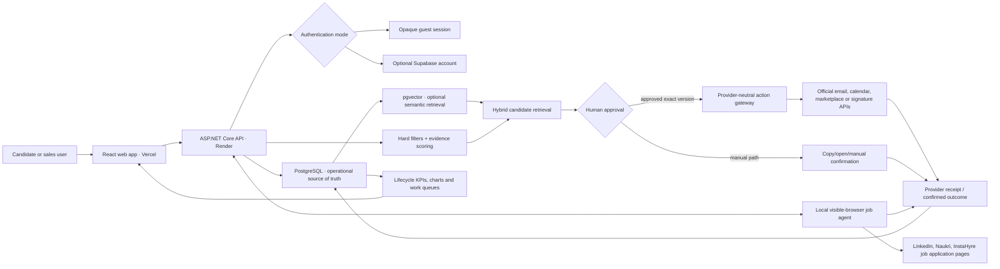
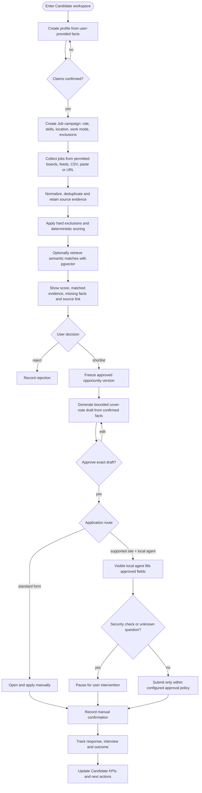

# OpportunityPilot product execution flow

Status: implementation map and operator contract. The editable FigJam overview is generated from this document.

## Product boundary

OpportunityPilot is one evidence-led workflow with two workspaces:

- **Candidate** finds suitable jobs, explains the match, requires approval, assists with applications and tracks outcomes.
- **Sales** finds suitable buyers/projects, explains the fit, requires approval, prepares outreach or bids, manages the
  resulting deal, and coordinates candidate submissions through interview, offer and contract.

The system may research, rank, draft, schedule and execute an action only through an explicitly supported provider.
It never treats a draft, copied message or uncertain provider response as a completed external action.

## Shared system architecture

The local agent is a Candidate application helper running on the user's computer. It is not a server-side LinkedIn
scraper and is not the Sales outreach mechanism. Sales LinkedIn actions remain manual unless an approved official
capability explicitly permits them.

## Candidate execution

## Staffing-sales execution

```mermaid
flowchart TD
  A(["Enter Sales workspace"]) --> B["Define services, roles, regions, proof, capacity and rate cards"]
  B --> C["Launch Customer, Partner, Investor or Freelance campaign"]
  C --> D["Discover demand from approved API/feed, licensed intelligence, CSV or user input"]
  D --> E["Resolve account/contact, deduplicate and retain source evidence"]
  E --> F["Apply ICP filters, evidence scoring and optional semantic retrieval"]
  F --> G{"Sales owner decision"}
  G -->|reject| H["Record reason"]
  G -->|shortlist| I["Create or link account, contact and deal"]
  I --> J["Prepare connection note, email, proposal or marketplace bid"]
  J --> K{"Approve exact recipient, content, rate and attachment version?"}
  K -->|edit| J
  K -->|yes| L{"Official provider supports execution?"}
  L -->|yes| M["Execute once with idempotency key"]
  L -->|no| N["Copy/open/manual send and confirmation"]
  M --> O{"Receipt confirmed?"}
  N --> O
  O -->|no or uncertain| P["Keep Unknown / Needs attention; do not retry blindly"]
  O -->|yes| Q["Advance deal and schedule follow-up"]
  Q --> R["Capture reply and manage conversation"]
  R --> S["Approve calendar invitation or scheduling link"]
  S --> T["Confirm requirement and choose company candidates"]
  T --> U["Apply candidate consent and field/document sharing choices"]
  U --> V["Freeze and approve candidate submission package"]
  V --> W["Deliver package and record receipt"]
  W --> X["Create interview rounds and candidate-visible updates"]
  X --> Y["Record client/candidate feedback and decision"]
  Y --> Z["Track candidate offer, commercial offer and start date"]
  Z --> AA["Prepare, approve and sign contract"]
  AA --> AB(["Won / Lost / On hold with complete audit"])
```

## Execution controls at every external action

1. Resolve the owner, workspace and exact source entity.
2. Verify recipient/contact facts; never invent an address or profile.
3. Apply suppression, consent, quota and provider-policy checks.
4. Bind approval to the exact content, recipient, commercial terms, attachments and version.
5. Use an idempotency key for provider execution.
6. Store provider receipt, explicit manual confirmation, or `Unknown`; never infer success.
7. Write an immutable activity and update the next action.
8. Derive dashboards from stored lifecycle events, not from optimistic UI state.

## KPI flow

Candidate charts derive sourced, qualified, shortlisted, applied, replied, interviewed and offered counts plus conversion
and ageing. Sales charts derive lead, contacted, replied, qualified, meeting, submission, interview, offer, placement and
contract counts plus conversion, source, owner, response time, ageing and value. A KPI changes only after the underlying
event is stored.

## Current integration boundary

| Area | Current product route | Needed for live provider execution |
|---|---|---|
| Candidate public research | Supported public boards/feeds plus imports | Provider keys only for optional sources |
| Candidate LinkedIn/Naukri/InstaHyre apply | Local visible-browser adapters exist | First real selector validation and user login |
| Sales LinkedIn | Draft + manual copy/open/send policy | Approved LinkedIn product/partner access for any API execution |
| Upwork/Freelancer bid | Draft, approval model and manual/API boundary | Approved provider API/MCP credentials and scope |
| Email | Internal exact-version drafts | Gmail or Microsoft OAuth connection |
| Calendar | Planned approved meeting workflow | Google or Microsoft OAuth connection |
| Signature | Planned contract lifecycle | Approved e-signature provider connection |
| Vector search | Architecture ready; no migration applied | Embedding provider/model choice and pgvector rollout |

See [STAFFING_SALES_INTEGRATION_PLAN.md](STAFFING_SALES_INTEGRATION_PLAN.md) for the provider policy and implementation
order, and [VECTOR_SEARCH_PLAN.md](VECTOR_SEARCH_PLAN.md) for the bounded semantic-search design.
