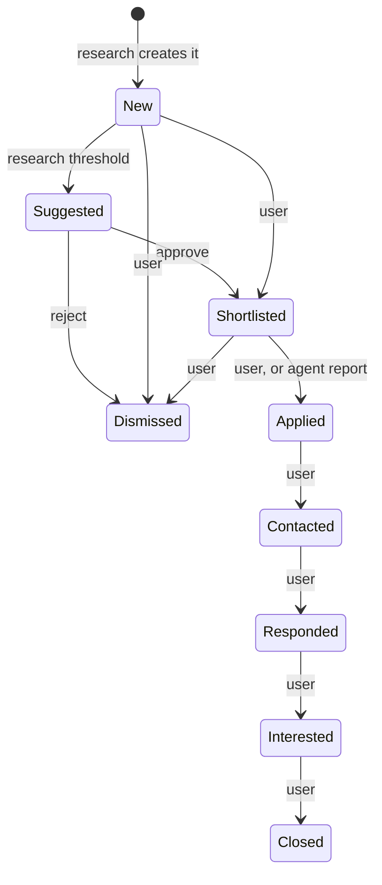
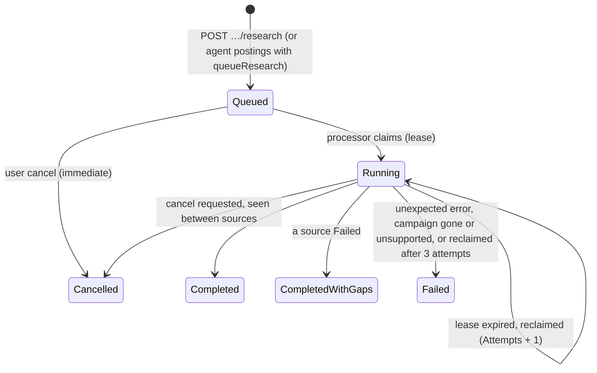

# Opportunity lifecycle

Every state of the core entities and who may move them. The limits behind these moves (lease length, attempts,
result limits) are in [business-rules.md](business-rules.md); the columns in [db-schema.md](db-schema.md).

## Opportunity status

Code: `Domain/Opportunities/Opportunity.cs`

Values: `New`, `Shortlisted`, `Dismissed`, `Applied`, `Contacted`, `Responded`, `Interested`, `Closed`.

The diagram shows the intended pipeline. **The API does not enforce an order**: the user may set any status from any
status, including moving an Applied opportunity back to New (see OQ-BE-011).

| Actor | Can move status? | How | Activity written |
|---|---|---|---|
| User | yes, to any value | `PATCH /api/v1/opportunities/{id}/status` → `ChangeStatus`; the same status is a no-op | `StatusChanged`, detail `From → To` |
| Research run | only New → Suggested | a Qualified Job result at or above the campaign's `AutoSuggestMinScore`; reruns preserve every non-New state | `Suggested` when queued; `Researched` when created or re-scored |
| Desktop agent | only to **Applied** | `POST /api/v1/applications/report` with `status: Applied` and the opportunity's id → `MarkApplied` from any status; idempotent once Applied | `Applied`, detail `Applied on <platform> by the desktop agent.` |

Only `Shortlisted` Job opportunities with a platform and external id are offered to the agent
(`GET /api/v1/agent/shortlist`); one already reported Applied is no longer offered. A cover note is included only when
its exact current version is Approved and its approval hash still matches; editing or revoking immediately removes it.

Every status change bumps `Version`. A user change racing a research save returns 409 to the user; the research run
merges the user's change instead of overwriting it.

## Filter outcome

Code: `Domain/Opportunities/FilterOutcome.cs`

`Qualified`, `NeedsVerification`, `Excluded`. Set by research only, recomputed on every run, so it can change between
runs (e.g. a source that later states the location). It never changes `Status`, and an Excluded opportunity can still be
shortlisted by the user.

## Research job

Code: `Domain/Research/ResearchJob.cs`, `Application/Research/ResearchRunner.cs`

| State | Terminal | Meaning |
|---|---|---|
| Queued | no | waiting for the processor; `Stage = Prepare` |
| Running | no | claimed; `LeaseUntil` set and renewed after each source |
| Completed | yes | every source read without failure (Skipped sources do not count as failures) |
| CompletedWithGaps | yes | at least one source Failed; `SafeError` says how many |
| Failed | yes | `SafeError` holds a safe reason and the job id as reference |
| Cancelled | yes | partial results are kept |

Stages, in order: `Prepare` → `Gather` (one event per source) → `Extract` → `Filter` → `Score` → `Complete`.
`Complete` is set only by `Finish` (or an immediate cancel). Counts are saved after every source.

| Rule | Detail |
|---|---|
| One active job | at most one Queued/Running job per campaign (filtered unique index; service check in demo mode); queueing again returns the active job |
| Claim | the processor picks the oldest claimable job (Queued, or Running with an expired lease) and saves the claim guarded by `Version`; losing that race just moves on |
| Lease lost | if another processor reclaimed the job (stored `Attempts` differs), this copy stops without writing |
| Poison job | a Running job claimed again after 3 attempts is set to Failed with "stopped after 3 interrupted attempts" |
| Shutdown | host stopping leaves the job Running; its lease expires and the next processor resumes it; upserts make the rerun safe |
| Cancel queued | `RequestCancel` → Cancelled at once, `Stage = Complete` |
| Cancel running | sets `CancelRequested`; the runner checks before each source and after gathering, then scores what it has and ends Cancelled |
| Cancel finished | no-op; returns the job unchanged |
| User vs processor saves | the runner merges concurrent user changes (cancel flag) property by property and retries up to 3 times |
| Resume | there is no resume endpoint; an interrupted job resumes only by lease expiry |

## Source status

Code: `Domain/Research/SourceStatus.cs`

| Status | Set when |
|---|---|
| Pending | created; and each time the desktop agent delivers postings (`MarkDelivered`) |
| Ok | the last run read it |
| Failed | the last run could not fetch or parse it; `SafeError` holds the reason; the run ends CompletedWithGaps |
| Skipped | nothing to read (no rows, empty paste, empty feed), a run limit was reached, or the page needs manual input |

Status reflects the **last** run only; a later run overwrites it.

## Import batch

Code: `Domain/Research/ImportBatch.cs`

Preview creates it → commit once within 1 hour → `Committed = true`. Expired or unknown → 404; committed twice → 409.

## Agent key

Code: `Domain/Agents/AgentKey.cs`

Active (created, plaintext shown once) → Revoked (`RevokedAt` set; idempotent). Revoked keys are rejected and no longer listed.

## Job application status

Code: `Domain/Applications/JobApplication.cs`

Values: `Applied`, `DryRun`, `NeedsManual`, `Skipped`, `Failed`. One row per (owner, platform, external job id).

| Stored | Later report | Result |
|---|---|---|
| anything except Applied | any status | status, detail and `occurredAt` follow the later report |
| Applied | Applied | status stays Applied; detail and `occurredAt` follow the later report |
| Applied | DryRun, NeedsManual, Skipped, Failed | **status, detail and `occurredAt` are kept**; only the job description (URL, title, company, location) refreshes |

A submitted application cannot be undone, so `Applied` is never downgraded.
